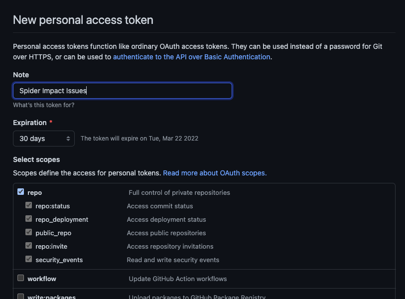
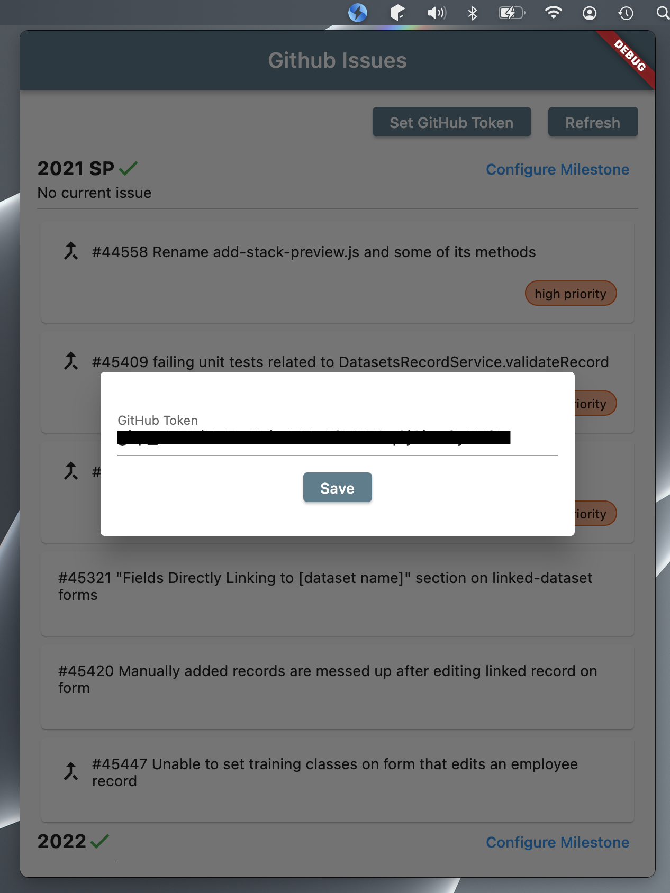
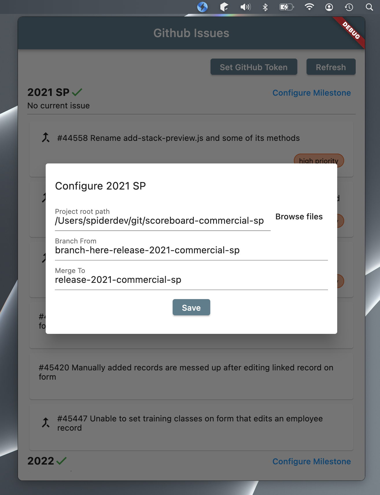
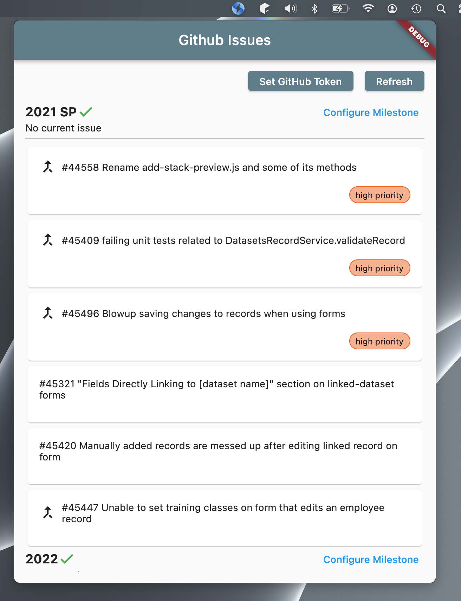
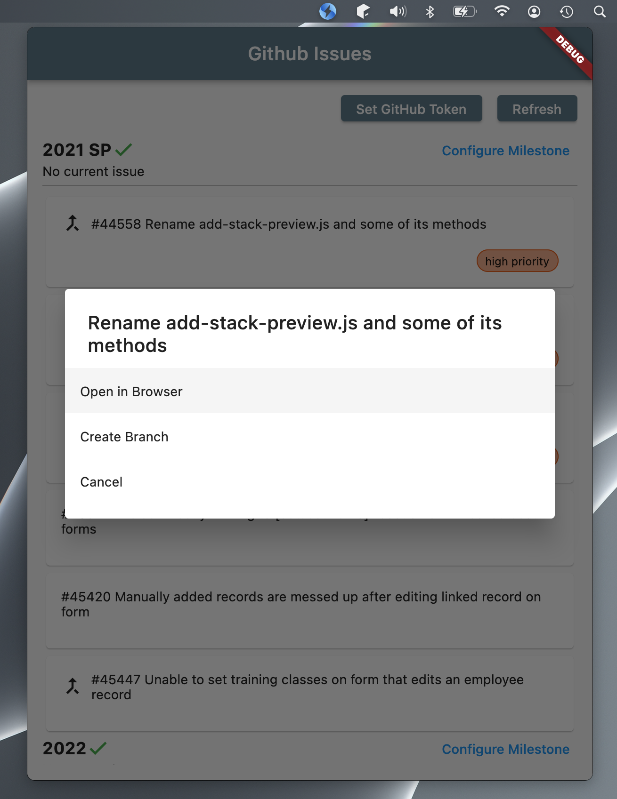
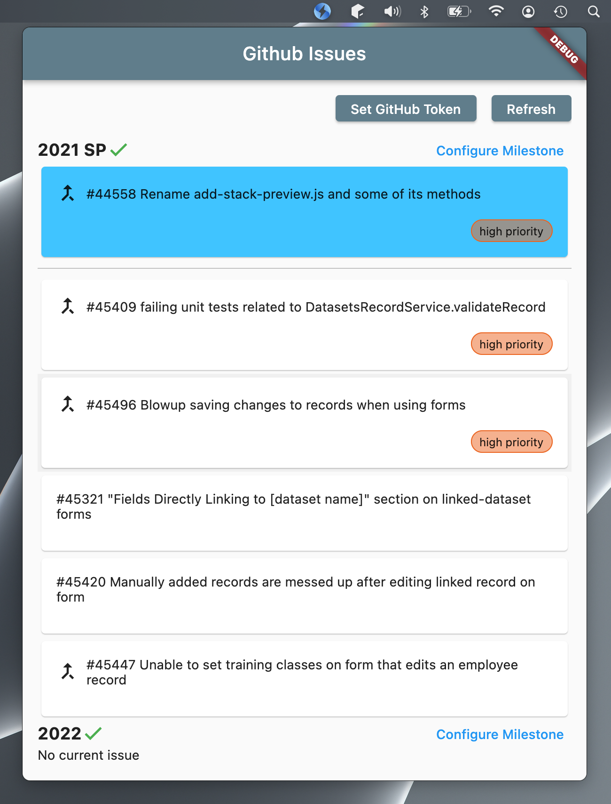
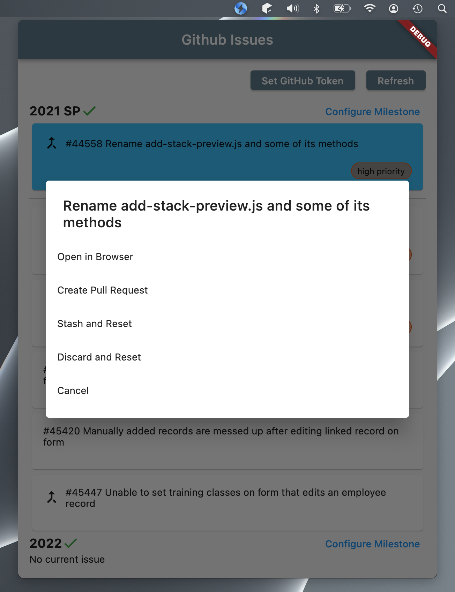

# Spider Impact Issues

A tool for managing Spider Impact issues and branches.

## Installation

1. Download the latest version from the releases section
2. Move the executable to the **Applications** folder
3. (Optional) Go to **System Preferences** > **Users & Groups** > **Login Items** and add **Spider Impact Issues** so it starts at login

## Setup

In order to see your GitHub issues, you must create a personal token in GitHub and provide it to **Spider Impact Issues**.

1. In your browser, Navigate to https://github.com/settings/tokens
2. Click **Generate new token**
3. Give all permissions under the **repo** category
    
    
4. Copy the new token to **Spider Impact Issues**

    

To be able to create branches and pull requests, you must also configure each milestone.

1. Next to the milestone you wish to configure, click **Configure**.
2. Enter or select the path to the root directory of your Impact source code (not the **cms** folder, the one above that)
3. Select the branch that you would like to create issue branches from. This typically starts with "branch-here-"
4. Select the branch you would like to create pull requests against. This is typically the same as the previous branch except without the "branch-here-" at the beginning of the name

## Features

### Ordered issue list

See all issues grouped by milestone, with the soonest due dates at the top. Within each milestone issues are ordered by:
* Non-blocked then blocked
* Highest Priority
* High Priority
* Low Priority
* No Priority
* Oldest Created Date

This should ideally always place the issues you should work on next at the top of the list

### Create branch

Create a branch directly from this app to start working on it.

Once you create the branch, this issue will be pinned to the top of the milestone to show what you're working on.

### Create pull request

From the active issue menu, you can create a GitHub pull request. A remote branch will be made, the code will all be committed, and a pull request will be created in the correct branch referencing the issue.

### Stash and restore

From the active issue menu, you can stash the current issue. This will create a stash of any changes and automatically reset to the main branch. If you create **Create Branch** for any issue that has a **Spider Impact Issues** generated stash, it will automatically be restored upon re-branching.